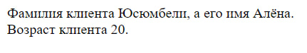
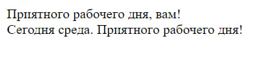
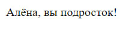
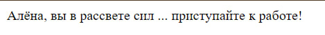
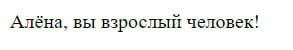
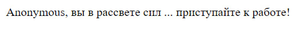
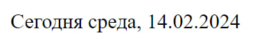
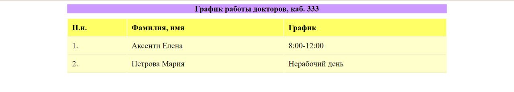

# Тема: Использование операторов. Условный оператор
# Задание 1
1. Создайте файл `index.php`, который содержит следующий код:
2. Анализируйте скрипт и объясните, что он реализуют.
> Данный PHP код выводит на экран информацию о клиенте, используя  переменные для его имени, фамилии и возраста. Он выводит фамилию с помощью переменной `$nume` и имя клиента с помощью переменной `$prenume`, а также его возраст - `$varsta`.
3. Сохраните файл.
4. Запустите веб сервер.
5. Интерпретируйте скрипт `index.php` используя виртуальный адрес скрипта.
6. Проанализируйте результат.

### Screenshot
 

# Задание 2
1. Добавьте в созданный файл `index.php`, следующий скрипт.
2. Сохраните и интерпретируйте скрипт.
3. Проанализируйте результат.
> Проверяется текущий день недели. Если сегодня пятница (`$d` равно "Fri"), то выводится сообщение "Хороших вам выходных!". В противном случае (если сегодня не пятница), выводится сообщение "Приятного рабочего дня, вам!"
4. Замените `if…else` на тернарный оператор. Анализируйте полученный результат.
```php
echo ($d =="Fri") ? "<br />Хороших вам выходных!" : "Приятного рабочего дня, вам!";
```
> Функционал остаётся таким же,но читаемость ниже.
5. Комментируйте использование тернарного оператора, оставив `if…else` и правильно добавьте следующий скрипт: …
6. Сохраните и интерпретируйте скрипт.
7. Проанализируйте результат.
>Результат остаётся таким же, но он будет выводиться с использованием блока `elseif`.
8. Замените буквенный параметр дня недели на цифровой в предыдущий скрипт (w –0-6) 
>Меняем параметр функции date()    
(обозначение):  
0-воскресенье  
  6-суббота
9. Сохраните и интерпретируйте скрипт.
10. Проанализируйте полученный результат.
> Поменялся тип параметра с текстового на числовой
11. Измените условие так что бы вы обработали текущий день недели и выведите соответствующее сообщение на экран
>Будет выводиться сообщения в зависимости от текущего дня недели.

### Screenshot
 
# Задание 3
1. Создайте файл `operator.php`, который содержит обработку данных оператором if и тернарным оператором.
2. Проанализируйте скрипт и обьясните что он 
реализует.
>Код определяет `$mesaj`, которое будет выведено в зависимости от переменной `$varsta` и от того, указано ли имя `$nume`.  
>
> В условии проверяется, к какой возрастной категории принадлежит человек (`$varsta`): подросток (от 13 до 19 лет), взрослый человек (старше 40 лет) или человек "в рассвете сил" (в остальных случаях). 
> 
> Затем с помощью тернарного оператора проверяется, указано ли  `$nume`. Если да, выводится имя и соответствующее сообщение, иначе выводится сообщение с приветствием для анонимного пользователя.  
3. Сохраните файл и запустите скрипт.
4. Проанализируйте результат.
5. Прокомментируйте строку в которой ставится в соответствие значение переменной nume. Интерпретируйте скрипт. Что вы заметили?
>Если значение `$nume` истинно (т.е. не пустое или не равно нулю), то будет выведено выражение1, которое состоит из значения `$nume`, и переменной `$mesaj`. Если условие ложно (т.е. значение `$nume` является пустым или равно нулю), то будет выведено выражение2, которое состоит из строки "Anonymous, " и переменной `$mesaj`.
### Screenshots
> Выводы программы в зависимости от возраста  

 
 
 
> Вывод при пустом значении переменной `$nume` при последнем условии в программе.

 

# Задание 4
1. Используя `switch ()` и функцию `date()`, с соответствующим параметром, проверьте день недели и выведите на русском: «Сегодня, день недели, дд.мм.гг»

>Функция `date("N")` возвращает порядковый номер текущего дня недели в виде строки(в отличии от формата `"w"` отсчёт с  начинается с единицы) .
### Screenshots
 
# Домашне задание 

1. Используя функцию „date()” из PHP и HTML элементы для создания таблиц, создайте таблицу с следующим контентом:  
__График работы докторов, каб. 333__  

| П.н. | Фамилия, имя |График|
|---|---|---|
| 1. | Аксенти Елена | xx - xx |
| 2. | Петрова Мария | yy - yy |

Вместо xx-xx, выведите 8:00-12:00, если день недели понедельник, среда или пятница. В обратном случае выведите „Нерабочий день”.Вместо yy-yy, выведите 12:00-16:00, если день недели вторник, четверг или суббота. В обратном случае выведите „Нерабочий день”.

### Screenshots
 


